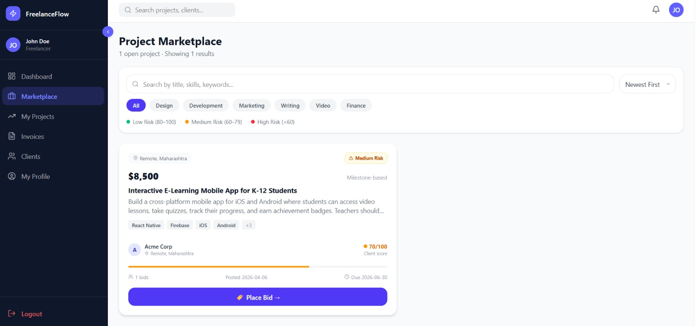
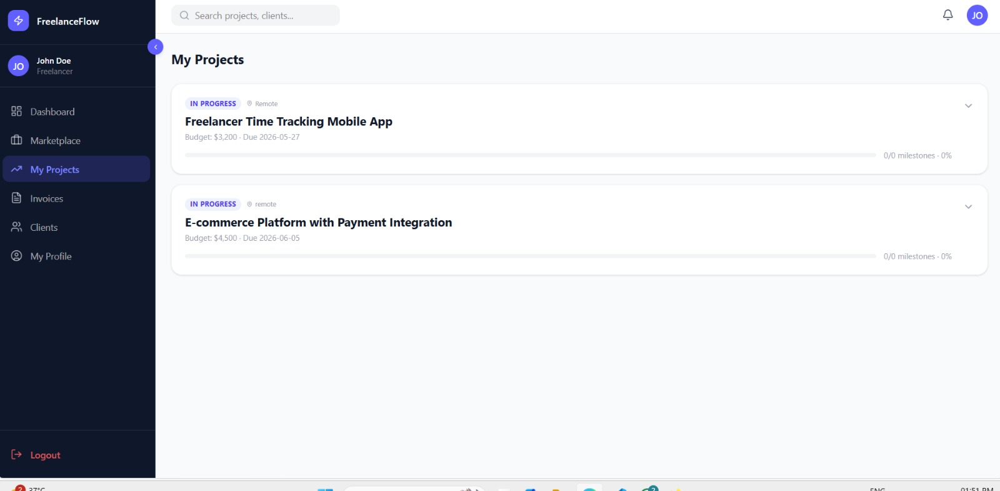
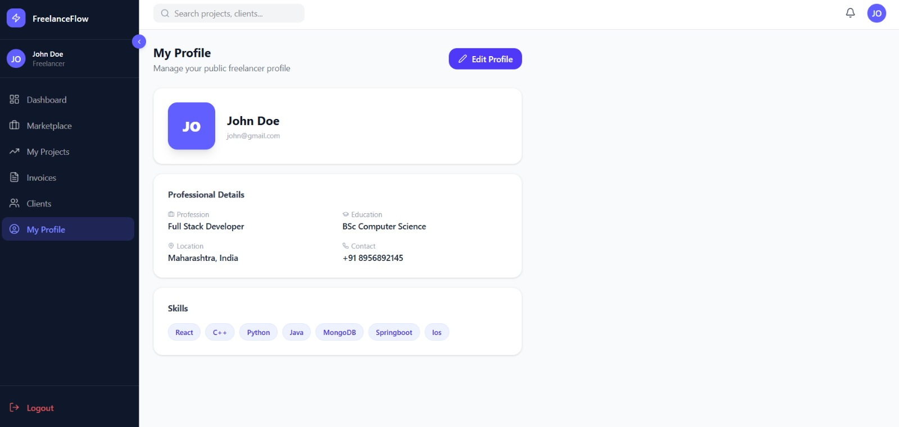
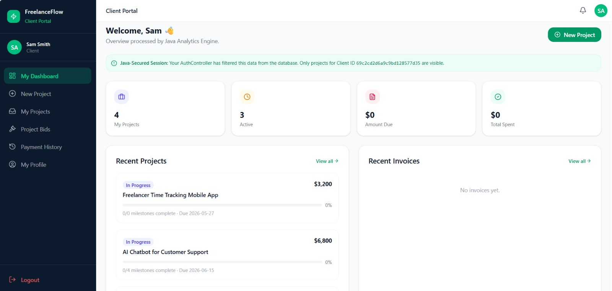
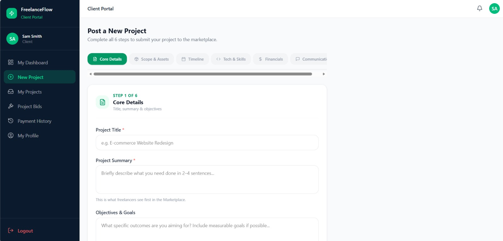
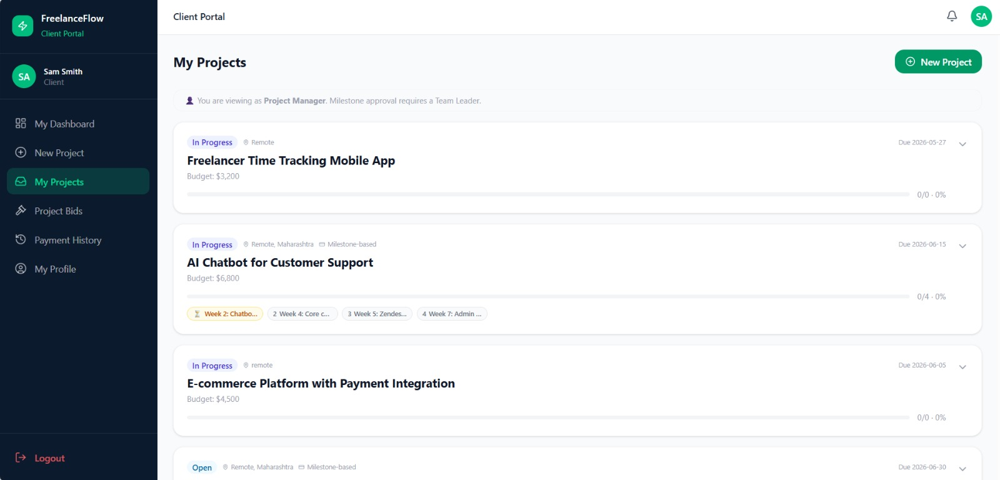
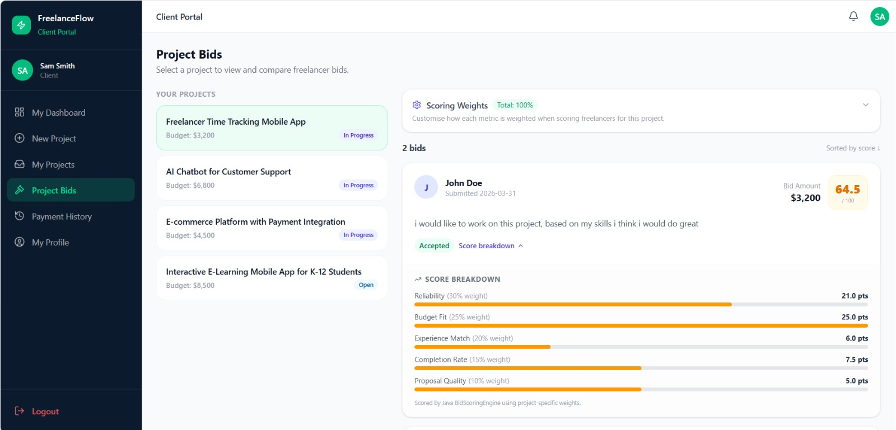
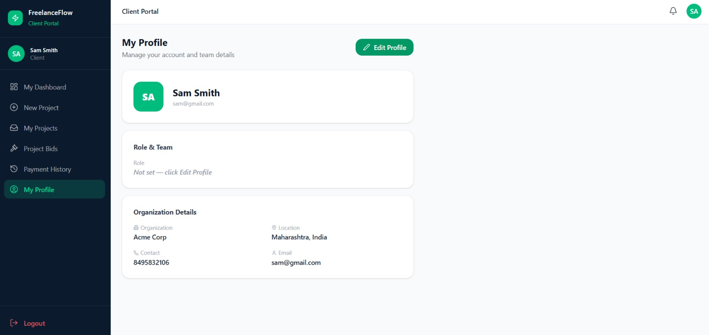

# FreelanceFlow

> A full-stack freelance project management portal with intelligent bid scoring, milestone-driven workflows, and team-aware collaboration.

**Live Demo:** [freelanceflow-nf7p.onrender.com](https://freelanceflow-nf7p.onrender.com/)


---

## Table of Contents

- [Overview](#overview)
- [Key Features](#key-features)
- [Screenshots](#screenshots)
- [System Architecture](#system-architecture)
- [Tech Stack](#tech-stack)
- [Getting Started](#getting-started)
- [Environment Variables](#environment-variables)
- [Project Structure](#project-structure)
- [API Overview](#api-overview)
- [Deployment](#deployment)
- [Documentation](#documentation)
- [License](#license)

---

## Overview

FreelanceFlow bridges the gap between freelancers seeking projects and clients seeking talent through a centralized, intelligent marketplace. Unlike existing platforms that rely on subjective, price-driven bid selection, FreelanceFlow introduces a **rule-based bid scoring engine** that ranks proposals across five weighted dimensions — giving both parties an objective foundation for decision-making.

**Core problems solved:**
- Clients can't objectively compare bids — FreelanceFlow scores every bid 0–100 across 5 metrics
- Freelancers can't assess client reliability before bidding — FreelanceFlow tracks payment history and computes reliability scores
- Fragmented milestone and invoice tracking — FreelanceFlow automates the full cycle from milestone approval to invoice payment
- Team visibility gaps — shared project/invoice views for team leaders and project managers without credential sharing

---

## Key Features

| Feature | Description |
|---------|-------------|
| **Bid Scoring Engine** | 5-metric weighted scoring (Reliability 30%, Budget Fit 25%, Experience Match 20%, Completion Rate 15%, Proposal Quality 10%). Clients can customize weights per project — all existing bids rescore instantly. |
| **Structured Project Creation** | 6-step form with formal scope, deliverables, tasks, out-of-scope items, and milestones. `ProjectValidator` enforces completeness server-side. |
| **Milestone → Invoice Lifecycle** | Freelancer marks complete → Client approves → Invoice auto-generated → Approved → Paid. Full audit trail with timestamps. |
| **Client Reliability Analytics** | Tracks avg payment delay and overdue invoice count per client. `AnalyticsEngine` computes reliability score (0–100), predicts deadline risk, and forecasts next-month income. |
| **Team Collaboration** | Clients sharing the same `teamLeaderName` share project and invoice visibility. Team leaders approve milestones/invoices; project managers process payments — all without shared credentials. |
| **Cloud Deployment** | Dockerized multi-stage build deployed on Render.com with MongoDB Atlas as the production database. |

---

## Screenshots

### Freelancer

**Dashboard — earnings, pending payments, reliability score, deadline risk alerts, next-month forecast**


**Marketplace — browse open projects, filter by skill/budget**



**My Projects — active projects with milestone tracking**



**Profile — skills, education, headline, contact info**



### Client

**Dashboard — total projects, amount due, total spent**



**Create Project — 6-step structured project creation form**



**My Projects — track all projects across the team**



**Bid Scoring — ranked bids with per-metric breakdown and customizable weights**



**Profile — business info, organizational role, team leader linkage**



---

## System Architecture

```
┌─────────────────────────────────────────────────────────┐
│                     CLIENT LAYER                        │
│  React 18 + TypeScript · Vite · Tailwind CSS 4          │
│  React Router 7 · Recharts · Radix UI / shadcn          │
│  AppContext (auth state) · AuthGuard (route guard)      │
└─────────────────────┬───────────────────────────────────┘
                      │  HTTP / REST (JSON)
┌─────────────────────▼───────────────────────────────────┐
│                  APPLICATION LAYER                      │
│           Spring Boot 4.0.3 / Java 21                   │
│                                                         │
│  Controllers: Auth · Bid · Profile · Milestone          │
│               Invoice · Team · Analytics · Admin        │
│                                                         │
│  BidScoringEngine (5-metric weighted)                   │
│  AnalyticsEngine (reliability · deadline · forecast)    │
│  ProjectValidator · ProjectDAO · BidDAO · InvoiceDAO    │
└─────────────────────┬───────────────────────────────────┘
                      │  MongoDB Wire Protocol
┌─────────────────────▼───────────────────────────────────┐
│                    DATA LAYER                           │
│          MongoDB (local dev) · MongoDB Atlas (prod)     │
│                                                         │
│  users · projects · bids · invoices · clients           │
└─────────────────────────────────────────────────────────┘
```

---

## Tech Stack

**Backend**
- Java 21, Spring Boot 4.0.3
- Spring Web (MVC), Spring Data MongoDB
- Lombok, Maven 3.9

**Frontend**
- React 18, TypeScript, Vite 6.3.5
- Tailwind CSS 4, React Router 7
- Recharts, Radix UI / shadcn, Lucide Icons

**Database**
- MongoDB (local development)
- MongoDB Atlas (production)

**DevOps**
- Docker (multi-stage build)
- Render.com (cloud hosting)
- GitHub (source control)

---

## Getting Started

### Prerequisites

- Java 21 JDK
- Maven 3.9+
- Node.js 20+
- MongoDB (local instance) or a MongoDB Atlas URI

### 1. Clone the repository

```bash
git clone https://github.com/<your-org>/freelanceflow.git
cd freelanceflow
```

### 2. Build the frontend

```bash
cd frontend
npm install
npm run build
cd ..
```

The built SPA output (`dist/`) is automatically served by Spring Boot from `src/main/resources/static/`.

### 3. Configure the database

By default the application connects to `mongodb://localhost:27017/freelanceflow`. To use MongoDB Atlas, set the `MONGODB_URI` environment variable before running:

```bash
export MONGODB_URI="mongodb+srv://<user>:<pass>@<cluster>.mongodb.net/freelanceflow"
```

### 4. Run the application

```bash
./mvnw spring-boot:run
# Windows:
mvnw.cmd spring-boot:run
```

Open [http://localhost:8080](http://localhost:8080) in your browser.

### 5. Frontend hot-reload (optional)

For active frontend development with instant hot-reload:

```bash
cd frontend
npm run dev   # starts on :5173, proxies /api/* to :8080
```

---

## Environment Variables

| Variable | Required | Default | Description |
|----------|----------|---------|-------------|
| `MONGODB_URI` | Production | `mongodb://localhost:27017/freelanceflow` | Full MongoDB connection string |
| `PORT` | Production | `8080` | HTTP port (auto-injected by Render.com) |

Both variables are configured in `src/main/resources/application.properties` with fallback defaults for local development.

---

## Project Structure

```
freelanceflow/
├── Dockerfile                    # Multi-stage Docker build (3 stages)
├── pom.xml                       # Maven (Java 21, Spring Boot 4.0.3)
├── src/main/java/com/freelanceflow/
│   ├── backend/                  # Spring Boot entry point
│   ├── controller/               # REST controllers + business engines
│   ├── dao/                      # MongoDB data access objects
│   ├── model/                    # Document POJOs
│   └── scoring/                  # BidScoringEngine
├── src/main/resources/
│   ├── application.properties    # App config (PORT, MONGODB_URI)
│   └── static/                   # Compiled React SPA (served by Spring Boot)
└── frontend/                     # React + TypeScript source
    ├── client/                   # Client-role page components
    ├── freelancer/               # Freelancer-role page components
    └── components/               # Shared layout, guards, UI library
```

Full annotated directory tree: [`docs/CODE_STRUCTURE.md`](docs/CODE_STRUCTURE.md)

---

## API Overview

Base URL: `http://localhost:8080` (local) or your Render.com URL (production)

| Category | Endpoints |
|----------|-----------|
| Authentication | `POST /api/auth/signup`, `POST /api/auth/login` |
| Profile | `GET/PUT /api/freelancer/profile`, `GET/PUT /api/client/profile` |
| Projects | `POST /api/client/create-project`, `GET /api/client/projects`, `GET /api/marketplace` |
| Bids | `POST /api/bids/submit`, `GET /api/bids/project`, `POST /api/bids/accept`, `PUT /api/bids/weights` |
| Milestones | `PUT /api/freelancer/milestone/complete`, `PUT /api/client/milestone/approve` |
| Invoices | `POST /api/freelancer/invoice/generate`, `PUT /api/client/invoice/approve`, `PUT /api/client/invoice/pay` |
| Dashboard | `GET /api/freelancer/dashboard`, `GET /api/client/dashboard-summary` |

Full API reference with request/response schemas: [`docs/API_REFERENCE.md`](docs/API_REFERENCE.md)

---

## Deployment

FreelanceFlow is deployed on [Render.com](https://render.com) using Docker.

**Live URL:** [https://freelanceflow-nf7p.onrender.com/](https://freelanceflow-nf7p.onrender.com/)

**Quick deploy steps:**
1. Push code to GitHub (Dockerfile is at the project root)
2. Create a Render Web Service → Environment: Docker
3. Add environment variable: `MONGODB_URI` = your MongoDB Atlas connection string
4. Deploy — Render builds the Docker image and starts the container

Full deployment guide: [`docs/DEPLOYMENT.md`](docs/DEPLOYMENT.md)

---

## Documentation

| Document | Description |
|----------|-------------|
| [`docs/USER_MANUAL.md`](docs/USER_MANUAL.md) | Step-by-step guide for Freelancers and Clients |
| [`docs/DEPLOYMENT.md`](docs/DEPLOYMENT.md) | Docker build, Render.com deployment, local setup |
| [`docs/API_REFERENCE.md`](docs/API_REFERENCE.md) | All REST endpoints with request/response details |
| [`docs/DATABASE_SCHEMA.md`](docs/DATABASE_SCHEMA.md) | MongoDB collection schemas (all 5 collections) |
| [`docs/ARCHITECTURE.md`](docs/ARCHITECTURE.md) | System design, module breakdown, data flow |
| [`docs/CODE_STRUCTURE.md`](docs/CODE_STRUCTURE.md) | Annotated directory tree of all source files |

---

## License

This project is licensed under the MIT License — see the [LICENSE](LICENSE) file for details.
